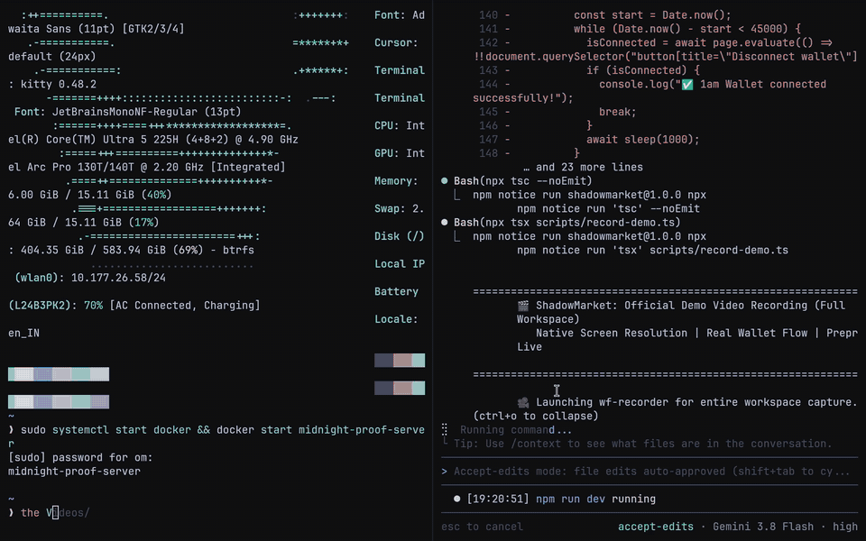
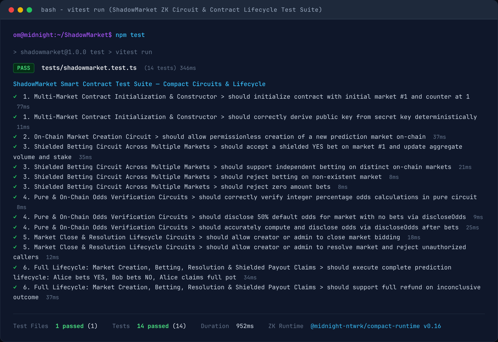

# ShadowMarket

[](https://github.com/Gamferno/ShadowMarket/actions/workflows/ci.yml)
[](https://preprod.midnightexplorer.com/contracts/0xa52c2b11fa381d65fdf201642560cc949a8b6b0427da02bc327bd090012ce75f)
[](https://github.com/midnightntwrk/compact)
[](LICENSE)
[](https://x.com/shadow_market1)

> **Privacy-Native Prediction Markets on the Midnight Network.**  
> Bet on real-world outcomes with 100% shielded individual stakes and side choices while aggregate market odds update on-chain verifiably via Zero-Knowledge PLONK proofs.

---

## Live Preprod Deployment

ShadowMarket is deployed and operational on the **Midnight Preprod Testnet**:

| Parameter | Value | Links |
|---|---|---|
| **Target Network** | `Midnight Preprod` | [Preprod Status](https://docs.midnight.network/) |
| **Contract Address** | `a52c2b11fa381d65fdf201642560cc949a8b6b0427da02bc327bd090012ce75f` | [View on Explorer ↗](https://preprod.midnightexplorer.com/contracts/0xa52c2b11fa381d65fdf201642560cc949a8b6b0427da02bc327bd090012ce75f) |
| **Deployment Transaction** | `818d801fcd9c2fc5cc72ebc25230f7699f7d75947f29fd723d8cc477ffb06f96` | [View Transaction ↗](https://preprod.midnightexplorer.com/transactions/0x818d801fcd9c2fc5cc72ebc25230f7699f7d75947f29fd723d8cc477ffb06f96) |
| **Block Height** | `2,692,353` | Block #2,692,353 |
| **Deployer Wallet** | `mn_addr_preprod152e9j8z922lzkldpfp6fwtwnuf9nz5dy5gsyf3r84q7nvcmtr04scnww85` | Unshielded Preprod Address |
| **Initial Market #1** | *"Will Midnight Mainnet launch with native Zero-Knowledge privacy in 2026?"* | Live on Preprod Ledger |
| **Live Web App Demo** | [`shadowmarket-woad.vercel.app`](https://shadowmarket-woad.vercel.app/) | [Launch DApp ↗](https://shadowmarket-woad.vercel.app/) |
| **Demo Preview (GIF)** | [`demo.gif`](demo.gif) | Animated Walkthrough / 960x600 @ 10fps (10.0 MB) |
| **Demo Video (MP4)** | [`demo.mp4`](demo.mp4) | Universal H.264 / 2880x1800 @ 30fps (22.2 MB, 2m 32s) |
| **Demo Video (WebM)** | [`demo.webm`](demo.webm) | High-Efficiency VP9 / 2880x1800 @ 30fps (13.2 MB, 2m 32s) |

---

## Demo Video



> 📥 **Full-Resolution High-Definition Downloads (2880x1800 @ 30fps)**:
> - [**`demo.mp4`**](demo.mp4) *(Universal H.264 / 22.2 MB, duration: 2m 32s)*
> - [**`demo.webm`**](demo.webm) *(High-Efficiency VP9 / 13.2 MB, duration: 2m 32s)*

The demo walkthrough (2m 32s, <3 minutes) demonstrates:
1. **Wallet Connection**: Connecting to Midnight Preprod via 1am Wallet (CAIP-372) and checking the local Docker proof server (port 6300).
2. **Markets Discovery**: Searching prediction markets, filtering by category chip, and viewing real-time responsive SVG odds charts.
3. **Shielded Bet Placement**: Placing a 50 tDUST bet on YES, generating the PLONK circuit proof locally, signing via 1am Wallet, and confirming the commitment hash on-chain.
4. **Permissionless Market Creation**: Submitting the `createMarket` transaction to deploy a new prediction market on-chain.
5. **Decrypted Portfolio**: Inspecting client-side decrypted positions in private browser storage.
6. **Oracle Resolution & Anonymous Claim**: Executing market resolution and claiming winning payouts with double-claim prevention via one-way cryptographic nullifiers.

---

## Why ShadowMarket?

Transparent blockchain prediction markets (such as Polymarket) suffer from three fatal structural vulnerabilities:

1. **Front-running & Toxic MEV**: Searchers and bots inspect the public mempool to front-run large bets or manipulate liquidity before block confirmation.
2. **Copy-Trading Exploitation**: High-alpha research analysts and domain experts cannot build sizable positions without automated copy-trading bots immediately crushing their odds.
3. **Surveillance & Doxxing**: Public ledger trails permanently tie a user's wallet address to their political, religious, philosophical, or financial beliefs.

**ShadowMarket solves this by leveraging Midnight Network's dual-state architecture:**
- Individual wager amounts, side choices (YES or NO), and bettor identity are **100% confidential**.
- The public ledger updates only the aggregate odds and liquidity pool via **Zero-Knowledge proofs**.
- Winning payouts are claimed **anonymously** using one-way cryptographic nullifiers, ensuring zero linkability between the original bet commitment and the payout withdrawal.

---

## 🛡️ Privacy Model: What an Observer Can and Cannot Learn

Midnight Network's dual-state architecture fundamentally separates **confidential client-side execution** from **public on-chain verification**. In ShadowMarket, users never reveal their personal beliefs, strategic analysis, or financial positions to the network, validators, indexers, or chain observers.

The table below defines the cryptographic privacy boundaries enforced by ShadowMarket's Compact smart contracts and client-side PLONK zero-knowledge circuits:

| Observer CANNOT Learn (Shielded Private State) | Observer CAN Learn (Public On-Chain Ledger) |
|---|---|
| **Bettor Identity & Wallet Address**<br>Neither unshielded nor shielded wallet addresses are associated with individual bets. Transactions prove validity without publishing caller identity. | **Aggregate Market Volume & Pool Size**<br>The sum total of stakes (`totalVolume`, `totalStakeYes`, `totalStakeNo`) is incremented verifiably on-chain without revealing who contributed. |
| **Individual Bet Amount (Stake Size)**<br>Exact wager amounts exist solely in private witness memory. Whales, funds, and retail participants place bets without revealing position sizes. | **Market Odds & Probability**<br>The current integer odds percentage (e.g. 70% YES / 30% NO) calculated by the ZK circuit and disclosed to the public ledger. |
| **Individual Direction Choice (YES or NO)**<br>Whether an individual bettor predicted YES or NO is cryptographically hidden inside a one-way Pedersen commitment. | **Market Metadata & Criteria**<br>Question title, detailed description, category chip, resolution deadline, and authorized resolver public key. |
| **Random Salt & Nonce**<br>A cryptographically secure random 32-byte salt ensures two identical bets (same amount, same side) yield completely distinct, unlinkable commitment hashes. | **Opaque Bet Commitment Hashes**<br>32-byte hash `persistentCommit(betData, salt)` added to the ledger mapping `betCommitments`, proving existence without revealing content. |
| **User Secret Key & Private Witness**<br>Private keys, derived roots, and local history remain in client storage (`inMemoryPrivateStateProvider`) and are never sent to RPC nodes or indexers. | **Spent Nullifiers**<br>One-way 32-byte nullifiers `persistentHash(secretKey, nonce)` published on payout claim to prevent double-spending without revealing which bet was claimed. |
| **Bet-to-Payout Linkability**<br>When claiming winning payouts, zero mathematical linkage exists between the withdrawal transaction and the original bet commitment. | **Market State Transitions**<br>Lifecycle status changes (`Open` → `Closed` → `Resolved`) and official verified winning outcome. |

### How This Eliminates Web3 Market Vulnerabilities

1. **Zero Toxic MEV & Front-Running**:
   - On Ethereum/Polygon prediction markets, front-running bots watch the public mempool for pending transactions. When a user submits a sizable wager, bots sandwich the trade, worsening execution prices.
   - **ShadowMarket Solution**: Because the bet amount and side choice are sealed within a zero-knowledge witness, mempool observers see only an opaque commitment hash and proof. There is zero exploitable information to sandwich or front-run.

2. **Immunity to Copy-Trading**:
   - Transparent order books allow copy-trading bots to monitor profitable wallets and automatically mirror their positions, collapsing the payout odds before the original researcher can complete accumulation.
   - **ShadowMarket Solution**: High-conviction analysts and researchers can build substantial positions across any market in complete confidentiality. Observers see only that total liquidity changed, with zero visibility into which side received capital.

3. **Protection Against Financial Surveillance & Doxxing**:
   - Public ledgers permanently archive every trade. Users who bet on contentious geopolitical events, elections, medical outcomes, or civic affairs risk being doxxed, cancelled, or targeted based on their public on-chain history.
   - **ShadowMarket Solution**: Your prediction history is stored exclusively in your own encrypted browser storage. Claiming winnings publishes only a cryptographically detached nullifier, ensuring complete financial anonymity.

---

## Zero-Knowledge Privacy Architecture

ShadowMarket enforces strict separation across Midnight's three execution boundaries:

```
┌────────────────────────────────────────────────────────────────────────┐
│                        PUBLIC LEDGER (ON-CHAIN)                        │
│  - Market metadata (Question, Category, Resolution Source)             │
│  - Aggregate totalVolume, totalStakeYes, totalStakeNo                  │
│  - Bet Commitments: Map<Bytes<32>, Boolean> (Opaque hashes)            │
│  - Claimed Nullifiers: Set<Bytes<32>> (Double-claim prevention)        │
│  - Disclosed Odds (via Compact discloseOdds circuit)                   │
└────────────────────────────────────▲───────────────────────────────────┘
                                     │  Verified by On-Chain Verifier
                                     │  (ZK-SNARK PLONK Proof)
┌────────────────────────────────────┴───────────────────────────────────┐
│                     CLIENT ZK CIRCUIT (LOCAL DOCKER)                   │
│  - placeShieldedBet: Proves stake > 0 & updates volume correctly       │
│  - discloseOdds: Verifies integer percentage odds arithmetic           │
│  - claimPayout: Proves commitment ownership & proportional payout      │
│  - Generates deterministic nullifier from secretKey + bet nonce        │
└────────────────────────────────────▲───────────────────────────────────┘
                                     │  Witness Context
                                     │  (Never leaves browser)
┌────────────────────────────────────┴───────────────────────────────────┐
│                   PRIVATE WITNESS (BROWSER STORAGE)                    │
│  - Bettor secretKey (Seed / Derived Private Key)                       │
│  - Individual bet direction (isYes: true / false)                      │
│  - Individual bet amount (Confidential wager)                          │
│  - Random salt (nonce) ensuring commitment hiding property             │
└────────────────────────────────────────────────────────────────────────┘
```

### Cryptographic Circuits

| Circuit | Execution | Ledger State Affected | Confidential Witness Inputs |
|---|---|---|---|
| `createMarket` | Public/Circuit | `marketCounter`, `markets` | Caller secret key |
| `placeShieldedBet` | Client ZK Proof | `betCommitments`, `markets` | Bet amount, isYes, bettor pk, nonce |
| `discloseOdds` | Client ZK Proof | Reads `markets` | Market ID, disclosed odds |
| `closeMarket` | Public/Circuit | `markets.state = Closed` | Caller secret key |
| `resolveMarket` | Public/Circuit | `markets.state = Resolved` | Caller secret key, winning outcome |
| `claimPayout` | Client ZK Proof | `claimedNullifiers` | BetData, salt, user secret, payout share |

---

## Application Pages & User Flows

ShadowMarket features all 7 production pages specified in the system design:

1. **Landing Page (`/`)**: Hero pitch, live Preprod status badges, 3-step Zero-Knowledge privacy flow diagram, protocol metrics, and featured on-chain market.
2. **Markets Catalog (`/markets`)**: Search filter, category selection chips (`Crypto/Macro`, `Politics`, `Sports`, `Local/Civic`, `Custom`), sorting options, and interactive market cards.
3. **Market Detail (`/markets/:id`)**: Dual-curve responsive SVG odds trajectory chart (YES vs. NO probability), shielded bet panel, potential return multiplier, and post-resolution payout claims.
4. **Create Market (`/create`, `/markets/new`)**: Permissionless market deployment form with live card preview, wired to the `createMarket` circuit on Preprod.
5. **Private Portfolio (`/portfolio`)**: Client-side decrypted positions dashboard with **Open Positions** and **History & Claims** tabs, plus one-click **Claim Payout** wired to `claimPayout` with nullifiers.
6. **Resolver & Admin Console (`/admin`)**: Oracle attestation dashboard with **Close Bidding**, **Resolve YES**, **Resolve NO**, and **Refund** actions safeguarded by an irreversible confirmation modal.
7. **About & Architecture (`/about`)**: Technical explainer comparing Polymarket vs. ShadowMarket, detailed execution boundaries, and interactive FAQ accordion.

---

## Tech Stack

- **Smart Contract Language**: Compact `pragma language_version >= 0.22`
- **Zero-Knowledge Runtime**: Midnight Network PLONK Prover & Verifier (`@midnight-ntwrk/compact-runtime`, `@midnight-ntwrk/compact-js`)
- **Web3 Wallet Integration**: Midnight DApp Connector CAIP-372 API (1am Wallet & Midnight Lace)
- **Frontend Framework**: React 19, TypeScript 5.7, Vite 6, Tailwind CSS
- **Routing**: `react-router-dom` v7 with `HashRouter` (guaranteeing 404-free static page reloads)
- **State & Cryptography**: `@midnight-ntwrk/midnight-js-contracts`, `inMemoryPrivateStateProvider`, `localStorage` receipt persistence
- **Testing**: Vitest 3 with Compact JavaScript simulator
- **CI/CD**: GitHub Actions (`.github/workflows/ci.yml`)

---

## Quickstart & Local Setup

### 1. Clone & Install Dependencies
```bash
git clone https://github.com/Gamferno/ShadowMarket.git
cd ShadowMarket
npm install
```

### 2. Compile Compact Smart Contracts
Compile the Compact contract to generate zero-knowledge intermediate representations (ZKIR), PLONK proving/verification keys, and typed JavaScript bindings:
```bash
# Compile Compact contract with full ZK circuit generation
npm run compile

# Or compile directly using the Compact CLI:
compact compile contracts/shadowmarket.compact managed/shadowmarket
```

### 3. Start the Midnight Proof Server (Docker)
In a separate terminal or background daemon, launch the local Docker proof server:
```bash
docker run -d \
  --name midnight-proof-server \
  -p 6300:6300 \
  midnightntwrk/proof-server:3.0.9
```

Verify that the proof server is healthy and responding:
```bash
curl http://127.0.0.1:6300/
```

### 4. Start Development Server
```bash
npm run dev
```
Open your browser at `http://localhost:3000/`.

---

## Testing & Verification

ShadowMarket includes an automated unit and circuit test suite covering multi-market creation, shielded betting, integer odds verification and disclosure, market closure, market resolution, and anonymous payout claims with nullifier double-claim prevention:

```bash
# Run all 14 contract and cryptographic circuit unit tests
npm test

# Run strict TypeScript typecheck
npm run lint

# Build production bundle with WASM support
npm run build
```

### Test Suite Execution Output (14 / 14 Passing)

```text
 ✓ tests/shadowmarket.test.ts (14 tests) 346ms
   ✓ ShadowMarket Smart Contract Test Suite — Compact Circuits & Lifecycle > 1. Multi-Market Contract Initialization & Constructor > should initialize contract with initial market #1 and counter at 1 77ms
   ✓ ShadowMarket Smart Contract Test Suite — Compact Circuits & Lifecycle > 1. Multi-Market Contract Initialization & Constructor > should correctly derive public key from secret key deterministically 11ms
   ✓ ShadowMarket Smart Contract Test Suite — Compact Circuits & Lifecycle > 2. On-Chain Market Creation Circuit > should allow permissionless creation of a new prediction market on-chain 37ms
   ✓ ShadowMarket Smart Contract Test Suite — Compact Circuits & Lifecycle > 3. Shielded Betting Circuit Across Multiple Markets > should accept a shielded YES bet on market #1 and update aggregate volume and stake 35ms
   ✓ ShadowMarket Smart Contract Test Suite — Compact Circuits & Lifecycle > 3. Shielded Betting Circuit Across Multiple Markets > should support independent betting on distinct on-chain markets 21ms
   ✓ ShadowMarket Smart Contract Test Suite — Compact Circuits & Lifecycle > 3. Shielded Betting Circuit Across Multiple Markets > should reject betting on non-existent market 8ms
   ✓ ShadowMarket Smart Contract Test Suite — Compact Circuits & Lifecycle > 3. Shielded Betting Circuit Across Multiple Markets > should reject zero amount bets 8ms
   ✓ ShadowMarket Smart Contract Test Suite — Compact Circuits & Lifecycle > 4. Pure & On-Chain Odds Verification Circuits > should correctly verify integer percentage odds calculations in pure circuit 8ms
   ✓ ShadowMarket Smart Contract Test Suite — Compact Circuits & Lifecycle > 4. Pure & On-Chain Odds Verification Circuits > should disclose 50% default odds for market with no bets via discloseOdds 9ms
   ✓ ShadowMarket Smart Contract Test Suite — Compact Circuits & Lifecycle > 4. Pure & On-Chain Odds Verification Circuits > should accurately compute and disclose odds via discloseOdds after bets 25ms
   ✓ ShadowMarket Smart Contract Test Suite — Compact Circuits & Lifecycle > 5. Market Close & Resolution Lifecycle Circuits > should allow creator or admin to close market bidding 18ms
   ✓ ShadowMarket Smart Contract Test Suite — Compact Circuits & Lifecycle > 5. Market Close & Resolution Lifecycle Circuits > should allow creator or admin to resolve market and reject unauthorized callers 12ms
   ✓ ShadowMarket Smart Contract Test Suite — Compact Circuits & Lifecycle > 6. Full Lifecycle: Market Creation, Betting, Resolution & Shielded Payout Claims > should execute complete prediction lifecycle: Alice bets YES, Bob bets NO, Alice claims full pot 34ms
   ✓ ShadowMarket Smart Contract Test Suite — Compact Circuits & Lifecycle > 6. Full Lifecycle: Market Creation, Betting, Resolution & Shielded Payout Claims > should support full refund on inconclusive outcome 37ms

 Test Files  1 passed (1)
      Tests  14 passed (14)
   Duration  952ms
 ZK Runtime  @midnight-ntwrk/compact-runtime v0.16.0
```



---

## Continuous Integration & CI/CD

ShadowMarket uses GitHub Actions ([`.github/workflows/ci.yml`](.github/workflows/ci.yml)) to run automated checks on every push to `main` and all pull requests:

- **Typecheck**: `npm run lint` (`tsc --noEmit`) validates all TypeScript types across the frontend, contract wrappers, and tests with zero diagnostics.
- **Unit & Circuit Tests**: `npm test` (`vitest run`) executes the full 14-test suite validating contract initialization, circuit state transitions, and nullifier enforcement.
- **Production Build**: `npm run build` (`tsc && vite build`) compiles all client assets, WASM binaries (`midnight_ledger_wasm`, `midnight_onchain_runtime_wasm`), and static bundles.

---

## Documentation Links

- [**docs/USAGE.md**](docs/USAGE.md): Complete end-to-end user guide, step-by-step walkthrough, privacy breakdown matrix, and troubleshooting playbook.
- [**docs/LAUNCH_TWEETS.md**](docs/LAUNCH_TWEETS.md): Official launch announcements and community marketing threads.
- [**docs/CHECKLIST.md**](docs/CHECKLIST.md): Technical verification checklist auditing all cryptographic circuits and architecture invariants.

---

## Community & Ecosystem Attribution

- **Product X (Twitter)**: [@shadow_market1](https://x.com/shadow_market1)
- **Midnight Network**: Built with pride on [Midnight Network](https://midnight.network) using Compact smart contracts.
- **Electric Capital Ecosystem**: This project is part of the Midnight developer ecosystem and tagged with `midnightntwrk` and `compact`.

---

## License

This project is licensed under the [MIT License](LICENSE).
