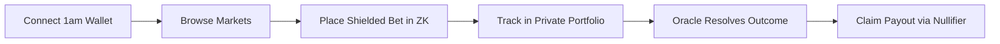

# ShadowMarket — Complete User & Operator Guide

Welcome to **ShadowMarket**, the first privacy-native prediction market protocol built on Midnight Network.

This guide provides a comprehensive, step-by-step walkthrough for participating as a bettor, deploying new prediction markets, operating the oracle resolver console, understanding the underlying Zero-Knowledge privacy model, and resolving common environment issues.

---

## Table of Contents
1. [Prerequisites & System Requirements](#1-prerequisites--system-requirements)
2. [End-to-End User Walkthrough](#2-end-to-end-user-walkthrough)
   - [Step 1: Connecting Your Midnight Wallet](#step-1-connecting-your-midnight-wallet)
   - [Step 2: Exploring Prediction Markets](#step-2-exploring-prediction-markets)
   - [Step 3: Placing a Shielded Bet](#step-3-placing-a-shielded-bet)
   - [Step 4: Monitoring Your Private Portfolio](#step-4-monitoring-your-private-portfolio)
   - [Step 5: Permissionless Market Creation](#step-5-permissionless-market-creation)
   - [Step 6: Market Close & Oracle Resolution](#step-6-market-close--oracle-resolution)
   - [Step 7: Anonymous Payout Claims via ZK Nullifiers](#step-7-anonymous-payout-claims-via-zk-nullifiers)
3. [The Zero-Knowledge Privacy Model](#3-the-zero-knowledge-privacy-model)
   - [What is Public on the Ledger?](#what-is-public-on-the-ledger)
   - [What Stays 100% Private in Browser Storage?](#what-stays-100-private-in-browser-storage)
   - [Cryptographic Invariants & Prover Guarantees](#cryptographic-invariants--prover-guarantees)
4. [Troubleshooting Playbook](#4-troubleshooting-playbook)
   - [Proof Server Connection Issues](#issue-1-local-proof-server-offline-or-unreachable)
   - [Wallet Connection & Extension Discovery](#issue-2-wallet-connection-rejected-or-extension-not-found)
   - [Insufficient Gas or Fee Balancing Failures](#issue-3-transaction-balancing-failed-or-insufficient-tdust)
   - [Payout Claim Rejection](#issue-4-payout-claim-fails-or-reverts)

---

## 1. Prerequisites & System Requirements

To interact with ShadowMarket on the live Midnight Preprod testnet, you need:

### 1. Midnight Proof Server (Docker)
Midnight uses client-side ZK-SNARK proving (PLONK) so that private witness data never leaves your machine.
Run the official Midnight Proof Server container locally:

```bash
docker run -d \
  --name midnight-proof-server \
  -p 6300:6300 \
  midnightntwrk/proof-server:3.0.9
```

- Verify that the proof server is healthy by opening `http://127.0.0.1:6300` in your browser or executing:
  ```bash
  curl -s http://127.0.0.1:6300/
  ```

### 2. Midnight Browser Wallet Extension
Install one of the supported Midnight Preprod browser extensions:
- **1am Wallet** (Recommended for developers)
- **Midnight Lace Wallet**

### 3. Preprod Testnet Tokens (tNIGHT & tDUST)
Transactions on Midnight require `tNIGHT` for unshielded network operations and `tDUST` for transaction fees:
1. Request test tokens from the official Midnight Preprod Faucet: [https://faucet.preprod.midnight.network](https://faucet.preprod.midnight.network)
2. In your 1am wallet, ensure your address is registered to generate `tDUST`.

---

## 2. End-to-End User Walkthrough



### Step 1: Connecting Your Midnight Wallet
1. Open the ShadowMarket DApp in your browser (e.g., `http://localhost:3000`).
2. Click the **Connect Wallet** button in the top navigation bar.
3. Select **1am Wallet** (or **Lace Wallet**).
4. Approve the connection request in the extension popup.
5. Once connected, your truncated address (e.g. `mn_addr_preprod15...`) and real-time Proof Server status indicator (`● Prover OK`) will display in the header.

### Step 2: Exploring Prediction Markets
1. Navigate to the **Markets** tab (`/markets`).
2. Use the **Search bar** to query by keyword (e.g., "Cardano", "Midnight", "AI").
3. Filter by category using the interactive chips:
   - `Crypto/Macro`
   - `Politics`
   - `Sports`
   - `Local/Civic`
   - `Custom`
4. Sort by **Trending**, **Highest Volume**, **Closing Soon**, or **Newest**.
5. Click **View Market** on any card to access the live detail page.

### Step 3: Placing a Shielded Bet
1. On the Market Detail page (`/markets/:id`), inspect the question, oracle resolution source, and estimated close date.
2. Review the **Interactive Odds Trajectory Chart** showing historical probability curves.
3. In the right-hand **Bet Panel**:
   - Toggle between **YES** (emerald) or **NO** (rose).
   - Enter your stake amount (e.g., `50` tDUST), or use the quick preset pills (`+10`, `+25`, `+50`, `+100`).
   - Observe the live **Expected Return Ratio** and **Potential Payout** calculation.
4. Click **Place Shielded Bet**.
5. Review the confirmation modal detailing your position and cryptographic privacy guarantees.
6. Click **Confirm & Generate ZK Proof**:
   - Stage 1: Constructing private witness.
   - Stage 2: Local PLONK proof generation on `http://127.0.0.1:6300`.
   - Stage 3: Injected wallet balances fees and signs transaction.
   - Stage 4: Broadcast to Midnight Preprod blockchain.
7. Upon confirmation, the 32-byte commitment hash and receipt are encrypted and saved to your browser's private local storage.

### Step 4: Monitoring Your Private Portfolio
1. Click the **Portfolio** tab (`/portfolio`) in the top navigation bar.
2. The portfolio decrypts your local receipts on-the-fly:
   - **Total Wagered**: Aggregate tDUST locked in shielded bets.
   - **Open Positions**: List of bets in active markets awaiting resolution.
   - **Claimable Wins**: Number of winning positions ready to claim.
   - **Total Claimed**: Historical payouts disbursed on Preprod.
3. In the **Open Positions** tab, review your position side, stake, date placed, and commitment hash.

### Step 5: Permissionless Market Creation
1. Click the **Create Market** tab (`/create` or `/markets/new`).
2. Fill out the market creation parameters:
   - **Market Question**: Precise binary proposition (e.g., *"Will Cardano surpass 100M total transactions before Q4 2026?"*).
   - **Category**: Select the relevant category.
   - **Resolution Source**: Official public oracle/source (e.g., *"Cardano Ledger Explorer & On-chain Metrics"*).
   - **Close Date & Time**: Timestamp after which bidding closes.
3. Check the **Live Card Preview** on the right to see how your card will appear in the catalog.
4. Click **Deploy Market to Preprod**:
   - Triggers the `createMarket` circuit in the Compact smart contract.
   - Assigns a sequential on-chain market ID.
   - Redirects you directly to your newly deployed market.

### Step 6: Market Close & Oracle Resolution
1. Navigate to the **Resolver Console** (`/admin`).
2. Filter markets by state (`Open`, `Closed`, `Resolved`).
3. For open markets reaching their expiration:
   - Click **Close Bidding** to invoke `closeMarket()`, locking out new bets while preserving existing stakes.
4. When the outcome is determined:
   - Click **Resolve YES**, **Resolve NO**, or **Refund (Inconclusive)**.
   - Confirm the permanent, irreversible action in the modal.
   - Triggers `resolveMarket(marketId, winningOutcome)` on-chain via cryptographic creator attestation.

### Step 7: Anonymous Payout Claims via ZK Nullifiers
1. Once a market resolves, navigate to **Portfolio** (`/portfolio`) and open the **History & Claims** tab (or open the market detail page directly).
2. Any winning bets display a prominent **Claim Payout →** button.
3. Click **Claim Payout**:
   - The browser constructs a ZK witness containing your secret key and original bet receipt salt.
   - Proves you own a valid winning commitment on-chain without revealing which commitment is yours.
   - Derives a deterministic 32-byte nullifier:
     $$\text{nullifier} = \text{persistentHash}(\text{"shadowmarket:nullifier:"}, \text{secretKey}, \text{nonce})$$
   - Submits `claimPayout(marketId)` to the Midnight Preprod smart contract.
   - The contract verifies the ZK proof, checks that the nullifier is unused, records it in `claimedNullifiers`, and disburses the proportional payout.
4. Your receipt is updated to `Claimed: ✓` with the transaction hash and disbursed amount.

---

## 3. The Zero-Knowledge Privacy Model

Traditional prediction markets (such as Polymarket) suffer from three fatal flaws on transparent blockchains:
1. **Front-running**: Searchers can inspect mempools and front-run large wagers.
2. **Copy-trading**: Whales cannot place positions without retail immediately mirroring their bets and crushing their odds.
3. **Financial surveillance**: Anyone can link a user's wallet address to their political, financial, or personal convictions.

ShadowMarket solves all three by partitioning execution across Midnight's three boundaries:

```
┌────────────────────────────────────────────────────────────────────────┐
│                        PUBLIC LEDGER (ON-CHAIN)                        │
│  - Market metadata (Question, Category, Resolution Source)             │
│  - Aggregate totalVolume, totalStakeYes, totalStakeNo                  │
│  - Bet Commitments: Map<Bytes<32>, Boolean> (Opaque hashes)            │
│  - Claimed Nullifiers: Set<Bytes<32>> (Double-spend prevention)         │
│  - Disclosed Odds (via Compact discloseOdds circuit)                   │
└────────────────────────────────────▲───────────────────────────────────┘
                                     │  Verified by On-Chain Verifier
                                     │  (ZK-SNARK PLONK Proof)
┌────────────────────────────────────┴───────────────────────────────────┐
│                     CLIENT ZK CIRCUIT (LOCAL DOCKER)                   │
│  - placeShieldedBet: Proves stake > 0 & updates volume correctly       │
│  - discloseOdds: Verifies integer percentage odds arithmetic           │
│  - claimPayout: Proves commitment ownership & proportional payout      │
│  - Generates deterministic nullifier from secretKey + bet nonce        │
└────────────────────────────────────▲───────────────────────────────────┘
                                     │  Witness Context
                                     │  (Never leaves browser)
┌────────────────────────────────────┴───────────────────────────────────┐
│                   PRIVATE WITNESS (BROWSER STORAGE)                    │
│  - Bettor secretKey (Seed / Derived Private Key)                       │
│  - Individual bet direction (isYes: true / false)                      │
│  - Individual bet amount (Confidential wager)                          │
│  - Random salt (nonce) ensuring commitment hiding property             │
└────────────────────────────────────────────────────────────────────────┘
```

### Privacy Matrix Summary

| Data Element | Visibility | Where It Lives | Cryptographic Protection |
|---|---|---|---|
| **Market Question & Rules** | **Public** | Public Ledger | Plaintext |
| **Market Expiration & State** | **Public** | Public Ledger | Plaintext |
| **Aggregate Market Volume** | **Public** | Public Ledger | Homomorphically proved via circuit |
| **Aggregate Odds (discloseOdds)** | **Public** | Public Ledger | Disclosed integer percentage |
| **Bettor Wallet Address** | **Private** | Browser only | Derived in ZK circuit; never posted with bet |
| **Individual Bet Amount** | **Private** | Browser local storage | Hidden inside `persistentCommit` hash |
| **Individual Side (YES / NO)** | **Private** | Browser local storage | Hidden inside `persistentCommit` hash |
| **Payout Claim Linkability** | **Unlinkable** | On-chain | One-way nullifier prevents linking bet to claim |

---

## 4. Troubleshooting Playbook

### Issue 1: Local Proof Server Offline or Unreachable
- **Symptoms**: Wallet badge displays `⚠️ Prover Offline`, or bet placement halts at `Generating Zero-Knowledge circuit proof...`.
- **Cause**: The local Docker proof server container is stopped or port `6300` is blocked.
- **Solution**:
  1. Check Docker container status:
     ```bash
     docker ps -a | grep proof-server
     ```
  2. If not running, start the container:
     ```bash
     docker start midnight-proof-server || docker run -d --name midnight-proof-server -p 6300:6300 midnightntwrk/proof-server:3.0.9
     ```
  3. Verify response:
     ```bash
     curl -I http://127.0.0.1:6300
     ```

### Issue 2: Wallet Connection Rejected or Extension Not Found
- **Symptoms**: Clicking "Connect Wallet" does nothing, or logs `CAIP-372 wallet not detected`.
- **Cause**: 1am or Lace extension is locked, not installed, or on the wrong network.
- **Solution**:
  1. Open your 1am or Lace extension and ensure you are logged in.
  2. Switch the network dropdown inside the extension to **Midnight Preprod**.
  3. Refresh the DApp page (`Ctrl+F5` or `Cmd+Shift+R`).

### Issue 3: Transaction Balancing Failed or Insufficient tDUST
- **Symptoms**: Transaction fails with `Insufficient funds` or `Cannot balance transaction recipe`.
- **Cause**: The connected wallet does not hold sufficient `tDUST` to pay state gas fees.
- **Solution**:
  1. Check your unshielded `tNIGHT` balance.
  2. In your 1am wallet, register DUST or convert a portion of `tNIGHT` into `tDUST`.
  3. Request additional faucet funds if your balance is zero: [https://faucet.preprod.midnight.network](https://faucet.preprod.midnight.network).

### Issue 4: Payout Claim Fails or Reverts
- **Symptoms**: `executeClaimPayout` throws `Invalid bet commitment` or `Payout already claimed`.
- **Cause**:
  - The market has not yet been resolved by the oracle.
  - The bet was placed on the losing outcome.
  - The nullifier for this bet receipt has already been submitted to the blockchain.
- **Solution**:
  - Check the market resolution badge in the UI. Payouts can only be claimed if `State == Resolved` and the outcome matches your bet (or is `Inconclusive`).
  - Check the **Portfolio > History** tab to verify if the receipt is already marked `Claimed: ✓`.
